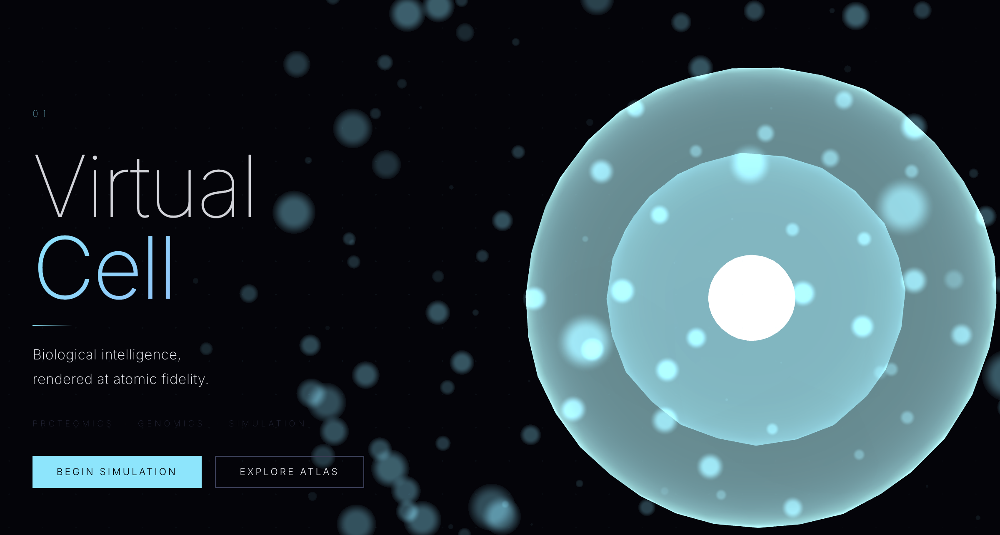

# Virtual Cell — Biological Intelligence Platform

A full marketing landing page for a biology SaaS product. Features a 3D morphing cell in WebGL, scroll-driven interactions, and six content sections built with vanilla JS, CSS, and Three.js.



## What This Is

This is an **open concept template** — a realistic, design-complete proposal for a computational biology SaaS platform. It is not a live product.

The technical foundations are real: the specs, stack recommendations, tool names, and architecture all reflect how such a platform would actually be built today using current research-grade open-source software.

**If you have the resources to build it:** everything in the Blueprint section is a genuine starting point. The simulation engines (GROMACS, OpenMM), structure prediction models (AlphaFold2, ESMFold), and biological databases (PDB, UniProt) are all freely available. The hard part — as the page states — is the compute infrastructure and scientific expertise.

**If you love the design:** the visual system (WebGL cell, dark theme, typography, section layouts) is intentionally general enough to adapt to any scientific, data-heavy, or technical product. Fork it, replace the copy, and point the three pillars at whatever your platform actually does.

## Stack

- **Vite ^6** — dev server + bundler
- **Three.js ^0.171.0** — WebGL scene, custom ShaderMaterials
- **pnpm** — package manager
- No framework, no runtime deps beyond Three.js

## Getting Started

```bash
pnpm install
pnpm dev       # opens at localhost:5173
pnpm build     # outputs to dist/
```

## Page Sections

| # | Section | Description |
|---|---------|-------------|
| 01 | **Hero** | WebGL 3D cell, scroll-morph, mouse-driven rotation |
| 02 | **Stats** | 4 key metrics with animated count-up on scroll |
| 03 | **Capabilities** | Proteomics / Genomics / Simulation — animated SVG visuals |
| 04 | **Technology** | 4-step process flow with sticky header |
| 05 | **Cell Atlas** | 3×2 grid of 6 cell types, CSS gradient visuals |
| 06 | **Data Readout** | Spec table + mock simulation terminal |
| 07 | **CTA** | Oversized typographic background, gradient headline |
| 08 | **Blueprint** | 6-row tech stack breakdown — how the platform would actually be built |
| — | **Footer** | Brand + 3-column navigation with anchor links |

## Visual Design

### Color tokens

| Token | Hex | Role |
|-------|-----|------|
| `--bg` | `#04040a` | page background |
| `--bg-2` | `#060610` | alternate section bg |
| `--bg-3` | `#080818` | darker section bg |
| `--text` | `#e8eaf0` | primary text |
| `--dim` | `#3a3e5a` | secondary / meta |
| `--accent` | `#6ee7ff` | ice blue |
| `--accent2` | `#a78bfa` | violet |
| `--accent3` | `#34d399` | emerald |

### Typography

| Variable | Font | Usage |
|----------|------|-------|
| `--font-display` | Syne 600–800 | Section headings, CTA |
| `--font-mono` | Space Mono | Numbers, data, terminal, labels |
| `--font-body` | Raleway 200–400 | Body copy, descriptions |
| `--font` | Inter 100–300 | Hero section only |

## WebGL Scene (main.js)

| Object | Geometry | Shader |
|--------|----------|--------|
| Membrane | `IcosahedronGeometry(1.0, 5)` | FBM noise displacement, fresnel + iridescence |
| Inner glow | `IcosahedronGeometry(0.65, 3)` | Same vertex, softer fragment |
| Nucleus | `SphereGeometry(0.18, 16, 16)` | MeshBasicMaterial pink, additive blend |
| Particles | 280 pts, Fibonacci sphere r=1.6–2.4 | Pulsing size + alpha |

### Shader uniforms

- `uTime` — elapsed seconds
- `uMorph` — 0 (calm) → 1 (morphed), driven by scroll position
- `uMouse` — vec2 normalized [-1, 1]

### Morph parameters

| State | Freq | Amplitude | Speed |
|-------|------|-----------|-------|
| Calm (uMorph=0) | 1.2 | 0.06 | 0.25 |
| Morphed (uMorph=1) | 2.8 | 0.42 | 0.75 |

## Interactions

- **Scroll** → morph: `morphTarget = scrollY / (heroHeight * 0.75)`, lerped at `0.04`
- **Scroll** → section reveals: `IntersectionObserver` adds `.is-visible` to `.reveal` elements
- **Mouse** → rotation: `mesh.rotation.y = baseRotY + mouseX * 0.35`, `mesh.rotation.x = mouseY * 0.20`
- **Mouse** → shader ripple: `uMouse` uniform passed to vertex shader for secondary noise pass
- **Resize** → camera aspect + renderer size updated

## Scroll Reveal System

Add `.reveal` to any element and optionally set `--reveal-delay` via inline style:

```html
<div class="reveal" style="--reveal-delay: 0.15s">...</div>
```

`sections.js` uses `IntersectionObserver` (threshold 0.12) to add `.is-visible`, which transitions opacity and translateY.

## SEO

The `<head>` includes a full SEO setup:

- **Meta description** and `robots` tag
- **Canonical URL** — update `href` to the production domain before deploying
- **Open Graph** tags for social sharing previews (og:title, og:description, og:image)
- **Twitter/X Card** — `summary_large_image` format
- **JSON-LD structured data** — `SoftwareApplication` schema for search engines
- **Favicon** — `<link rel="icon" href="/favicon.svg">` — replace with real assets before deploying

The placeholder domain used throughout is `https://virtualcell.io/`. Update all four occurrences (canonical, og:url, og:image, twitter:image) before going live.

## Deployment

Vercel detects Vite automatically. Push to Git, connect repo — no `vercel.json` needed.

## File Structure

```
virtual-cell/
├── package.json
├── README.md
├── index.html
└── src/
    ├── style.css     ← all styles (hero + sections)
    ├── main.js       ← Three.js scene + GLSL shaders
    └── sections.js   ← scroll reveals + counter animation
```
